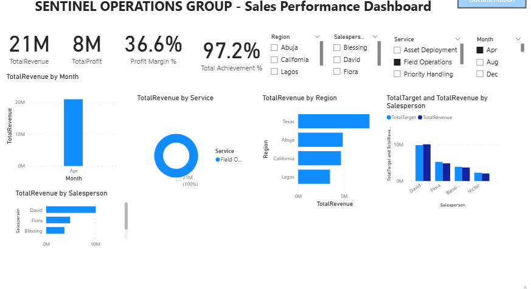

# Sales Performance Dashboard — Power BI
## Overview
Interactive Power BI dashboard analyzing sales performance across regions, services, and sales representatives for Sentinel Operations Group. Built to replace a static Excel reporting system with real-time, filterable insights.
## Problem Statement
Management relied on Excel pivot tables and static charts for sales reporting, which was:
- Time-consuming to update
- Difficult to filter by multiple dimensions
- Not visually compelling for executive presentations

## Solution
Built a fully interactive Power BI dashboard featuring:
- **4 KPI cards** — Total Revenue, Total Profit, Profit Margin %, Target Achievement %
- **5 interactive charts** — Monthly trends, regional breakdown, salesperson rankings, service analysis, target vs. actual comparison
- **4 slicers** — Filter by Region, Salesperson, Service, and Month
- **Documentation page** — Built-in project guide with navigation

## Key Metrics Tracked
| Metric | Value |
|--------|-------|
| Total Revenue | 2.0B |
| Total Profit | 600M |
| Profit Margin | 38.1% |
| Target Achievement | 95.0% |

## Tools & Technologies
- **Power BI Desktop** — Data modeling, DAX, visualization
- **DAX** — Custom measures (Revenue, Profit, Margin %, Target Achievement)
- **Power Query** — Data transformation and cleaning
- **DateTable** — Custom calendar table for time intelligence

## Data Model
- **Fact Table:** Raw sales transactions (500+ records)
- **Dimension:** DateTable (CALENDARAUTO with marked date table)
- **Relationship:** Many-to-one (Raw_Data → DateTable on Date)

## What I Learned
- Building star schema data models in Power BI
- Writing DAX measures for business KPIs
- Designing for executive consumption (clean layout, key metrics first)
- Creating intuitive navigation between report pages

## Connect With Me
- **Email:** victorukwadinamor@gmail.com
- **Location:** Lagos, Nigeria (Remote-ready, GMT/CET/EST flexible)

---
Open to remote opportunities in: Financial Analysis | Business Intelligence | Data Analytics | Accounting Systems

## Project 2: HR Analytics Dashboard

Built for Meridian Workforce Group. 500 employees across 5 countries. Power BI, DAX, interactive slicers.

KPIs: Total Employees, Active Employees, Average Salary, Turnover Rate, Performance Rating

Charts: Employees by Department, Salary by Country, Performance by Job Level, Status Distribution, Hiring Trend, Salary Distribution

